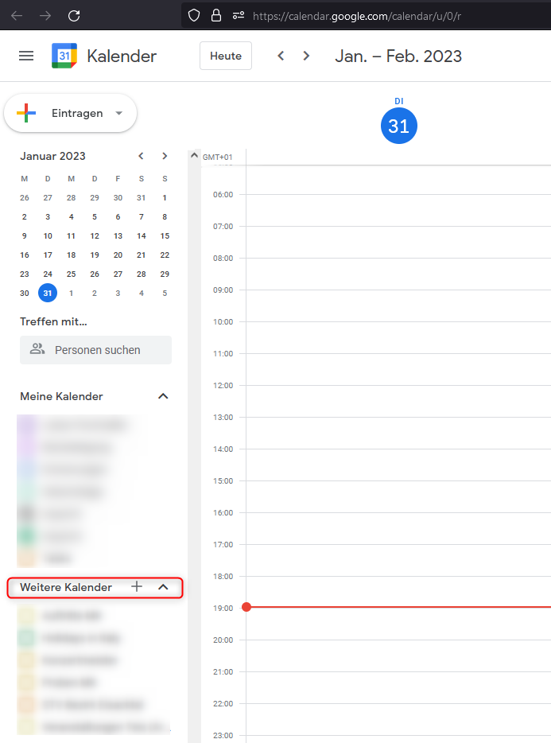

# Google / Android

Diese Anleitung gilt, wenn du eine Gmail-Adresse hast. 

1. Melde dich in deinem [Google Kalender](https://www.google.com/calendar) auf einem PC/Mac an. Vom Handy aus wird es nicht ohne Weiteres funktionieren. 
2. Auf der linken Seite findest du den Punkt "Weitere Kalender"

3. Klicke dort auf das Plus (+) und wähle "Per URL". 
4. Trage im Eingabefeld die URL genau so ein, wie du sie erhalten hast. Achte auf Tippfehler. Die URL muss genau stimmen. Das Feld "Den Kalender öffnetlich machen" kannst du nicht angehakt lassen. 
5. Klicke dann auf "Kalender hinzufügen". 
6. Der Kalender wird dann links in deiner Liste an Kalender erscheinen.
7. Warte anschließend etwas, bis der Kalender auf deinem Mobiltelefon synchronisiert wurde. 
8. Abhängig von der verwendeten Kalender-App kann es notwendig sein, den Kalender auf dem Handy noch zu aktivieren um ihn zusätzlich zu deinen Terminen an zu zeigen. 

# Google Kalender App
Wenn du die Kalender App direkt von Google verwendest und der neue Kalender auch nach ein bis zwei Stunden nicht auf dem Mobiltelefon aufscheint, dann ist es neuerdings notwendig die Synchronisierung für Zusatzkalender zusätzlich auf dem Mobiltelefon zu aktivieren. Das erreichst du, *nachdem* du die o.g. Schritte durchgeführt hast, wiefolgt: 

1. Öffne die Google Kalender App. 
2. Tippe links oben auf dem Bildschrim auf die ddrei Striche um das Seitenmenü zu öffnen. 
3. Suche in der Liste nach deinem Google-Konto und kontrolliere ob der neue Kalender hier aufscheint. Wenn ja, dann stelle sicher, dass ein Häckchen vor dem Namen des Kalender gesetzt ist. Dann ist die Einrichtung abgeschlossen. 
4. Sollte der Kalender nicht sichtbar sein und du bereits ein bis zwei Stunden gewartet haben, dann gehe in dieser Liste bis ganz nach unten. 
5. Dort findet sich ein Symbol mit einem Zahnrad und "Einstellungen". Tippe auf das.
6. Suche in der jetzt erschinenen Liste nach deinem Google Konto bzw. deiner E-Mailadresse und tippe unter der Liste der Kalender unter dieser E-Mailadresse auf "Weitere Anzeigen". 
7. Nun solltest du deinen neuen Kalennder sehen. Tippe ihn einmal an. 
8. Im neuen Menü musst du unter "Synchronisierung" den Wahlschalter aktivieren, sodass die Synchronisierung aktiv wird. 
9. Gehe zurück und kontrolliere nochmals Punkt 3. 