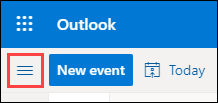

# Outlook.com
## Abonnieren eines Kalenders

> **Hinweis**
> Wenn Sie einen Kalender abonnieren, wird Ihr Kalender automatisch aktualisiert, wenn der andere Kalender aktualisiert wird. Dies kann manchmal mehr als 24 Stunden dauern.

1. Melden Sie sich bei Outlook.com an.

2. Wählen Sie unten auf der Seite Kalender  aus.

3. Wählen Sie im Navigationsbereich **"Kalender hinzufügen"** aus.

4. Wählen Sie **Vom Web abonnieren** aus.

   

5. Geben Sie die URL für den Kalender ein.

6. Wählen Sie **Importieren** aus.

## Vorgehensweise, wenn "Kalender hinzufügen" nicht angezeigt wird

Wenn Sie den Navigationsbereich neben dem Kalender reduziert haben, müssen Sie ihn erweitern, um das Feature **"Kalender hinzufügen"** zu erreichen.

Um den Navigationsbereich zu erweitern, wählen Sie das Symbol Symbol mit den drei Strichen zum Erweitern oder Reduzieren des linken Bereichs oben im Kalender aus.

